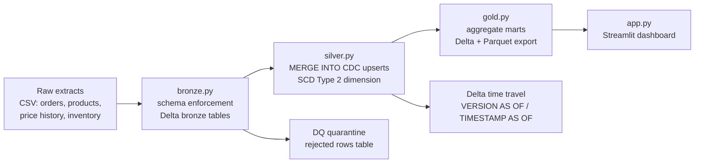

# Databricks Lakehouse for Retail


A **medallion-architecture lakehouse** (bronze → silver → gold) on **Delta Lake**,
built Databricks-ready: seeded retail data (orders, product price history,
daily inventory snapshots) flows through schema-enforced bronze ingestion,
`MERGE INTO` CDC upserts, an **SCD Type 2** product dimension, a data-quality
quarantine pattern, and **Delta time travel** — landing in gold aggregate marts
served by a Streamlit dashboard.

> 🎬 **Live demo:** [https://databricks-lakehouse-retail-hmugazzddtuvw4qnb878rw.streamlit.app/](https://databricks-lakehouse-retail-hmugazzddtuvw4qnb878rw.streamlit.app/)

## Architecture



## Features

- **Bronze with schema enforcement** — explicit PySpark schemas on every raw
  extract; malformed rows fail fast instead of silently becoming NULLs.
- **Silver `MERGE INTO` CDC** — a simulated change-data-capture feed upserts
  orders on `order_id` (latest update wins), exactly like a Debezium/Kinesis
  stream landing in the lakehouse.
- **SCD Type 2 product dimension** — every price change closes the current
  version (`effective_to`, `is_current = false`) and opens a new one; full
  price history is queryable forever.
- **Data-quality quarantine** — rows violating invariants land in
  `silver_orders_quarantine` for triage instead of being dropped.
- **Delta time travel** — `DESCRIBE HISTORY`, `VERSION AS OF`, and
  `TIMESTAMP AS OF` queries (see `notebooks/04_time_travel_and_quality.py`).
- **Gold marts** — `daily_sales`, `inventory_health` (days-of-cover +
  stockout-risk flags), `category_performance`, each as a Delta table plus a
  Parquet export for the demo.
- **Databricks notebooks** — `notebooks/01–04` mirror the pipeline in
  Databricks notebook format with `%sql` cells and production mappings.

## Quickstart

### Local run (needs Java 11+ for PySpark)

```bash
pip install -r requirements-pipeline.txt

# 1. Generate the seeded synthetic retail data (seed=42)
python data/generate.py

# 2. Run the full medallion pipeline: bronze -> silver -> gold
python -m src.run

# 3. Launch the dashboard (reads gold/*.parquet, no JVM needed)
pip install -r requirements.txt
streamlit run app.py
```

> ⏳ First pipeline run resolves the Delta Lake packages from Maven —
> expect a minute or two. Re-runs are incremental (MERGE, not rewrite).

### Demo only (no Java / no Spark)

```bash
pip install -r requirements.txt
python data/generate.py   # also writes gold/*.parquet via the pandas fallback
streamlit run app.py
```

### Import the notebooks into Databricks

1. In your Databricks workspace: **Workspace → Import**, upload the four
   `.py` files from `notebooks/` (Databricks detects the
   `# Databricks notebook source` format automatically), or
   `databricks workspace import-dir ./notebooks /Workspace/retail-lakehouse`.
2. Attach each notebook to a cluster with **Databricks Runtime 14.3+**
   (Delta Lake is built in — no `delta-spark` pip install needed).
3. Replace the `/mnt/retail-lake/...` paths with your Unity Catalog volume
   paths (e.g. `/Volumes/main/retail/raw`), then **Run all** in order
   `01 → 04`.

## Project structure

```
├── app.py                  # Streamlit dashboard (pandas + plotly, reads gold/*.parquet)
├── data/
│   └── generate.py         # seeded retail data: 40 products, ~15k orders, price history, inventory snapshots
├── src/
│   ├── bronze.py           # raw CSV -> Delta bronze tables, explicit schemas
│   ├── silver.py           # DQ quarantine, MERGE INTO CDC upserts, SCD Type 2 dimension
│   ├── gold.py             # gold marts: Delta tables + gold/*.parquet exports
│   ├── transforms.py       # pure-python/pandas equivalents (unit-tested, no JVM)
│   └── run.py              # orchestrator: bronze -> silver -> gold with row counts
├── notebooks/
│   ├── 01_bronze_ingestion.py        # Databricks notebook: Auto Loader mapping
│   ├── 02_silver_cdc_scd2.py        # Databricks notebook: MERGE + SCD2
│   ├── 03_gold_marts.py             # Databricks notebook: %sql marts
│   └── 04_time_travel_and_quality.py # time travel + warehouse invariant checks
├── tests/
│   └── test_pipeline.py    # pytest: SCD2 logic, quarantine rules, gold aggregations
├── requirements.txt            # demo-only deps (Streamlit Cloud friendly)
├── requirements-pipeline.txt   # full pipeline deps (PySpark + Delta Lake)
└── Dockerfile
```

## The data

Seeded (`seed=42`), deterministic, 90 days from 2026-07-01:

| Dataset | Rows | Notes |
|---|---|---|
| products | 40 | 6 categories (Electronics, Apparel, Home & Kitchen, Sports, Beauty, Toys) |
| product price history | ~120 | 2–3 price changes per product → drives the SCD2 dimension |
| orders | ~15,000 | weekend uplift, per-product demand weights, discounts |
| order CDC updates | 300 | corrections to existing orders → drives the MERGE upsert |
| inventory snapshots | 3,600 | daily per product, with replenishment → some SKUs run low |

## Production extensions

- **Auto Loader** — replace the local CSV reads in `bronze.py` with
  `spark.readStream.format("cloudFiles")` on an S3/ADLS landing bucket;
  `cloudFiles.schemaLocation` tracks schema evolution (notebook 01 shows the mapping).
- **Delta Live Tables** — the silver MERGE/CDC logic maps 1:1 to DLT
  `APPLY CHANGES INTO ... KEYS (order_id) SEQUENCE BY (updated_at)`;
  the quarantine pattern becomes DLT expectations (`EXPECT ... ON VIOLATION DROP`).
- **Databricks SQL** — point dashboards and alerts directly at the gold Delta
  tables; add a stockout-risk alert on `gold_inventory_health WHERE risk = 'high'`.
- **Unity Catalog** — `bronze` / `silver` / `gold` become catalog schemas with
  governed table ACLs, column masking on PII, and full lineage from raw to mart.
- **Databricks Workflows** — orchestrate `01 → 04` as a multi-task job with
  retries and SLA alerts instead of `src/run.py`.
- **Liquid clustering + Z-ORDER** — `ZORDER BY (order_date)` on
  `silver_orders` and `ZORDER BY (snapshot_date, product_id)` on
  `silver_inventory` once volumes grow past the demo scale.
- **Change data feed** — enable Delta CDF on silver tables so downstream
  consumers read only changed rows instead of full snapshots.

## License

MIT
